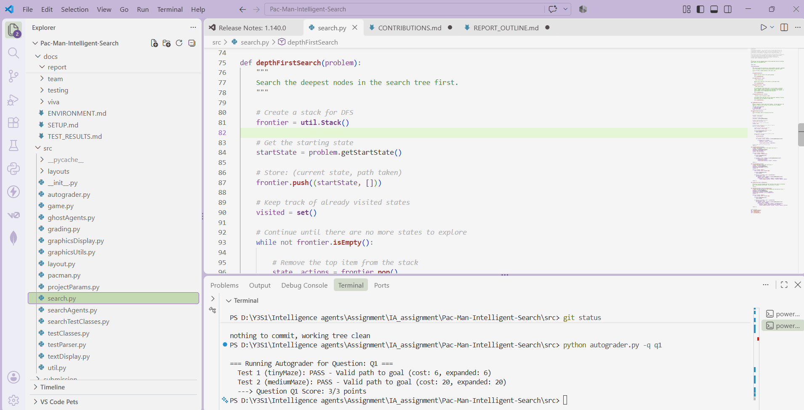

# Group Report Outline

## 1. Introduction & Problem Statement
- Overview of Pac-Man state-space search.

## 2. Uninformed Search Algorithms (Q1 - Q3)

### 2.1 Depth First Search (Q1) — S.P.R.H. Wijesiri (IT24100602)

**Logic & Implementation:** Depth First Search (DFS) explores the state space by following one path as deeply as possible before backtracking. We implemented DFS in the `depthFirstSearch(problem)` function in `search.py` using `util.Stack`, which follows the Last-In, First-Out (LIFO) principle.

The algorithm begins by obtaining the start state using `problem.getStartState()` and pushing it onto the stack together with an empty action list. During each iteration, a state and its associated action path are popped from the stack. The algorithm checks whether the current state is the goal using `problem.isGoalState(state)`. If it is the goal, the sequence of actions is returned.

A `visited` set is used to keep track of expanded states. This prevents cycles and ensures that the same state is not expanded more than once. For each unvisited successor returned by `problem.getSuccessors(state)`, the new action is added to the current action path and the successor is pushed onto the stack.

**Autograder Evidence:**

### 2.2 Breadth First Search (Q2)
- Breadth First Search formulation and optimality proof.

### 2.3 Uniform Cost Search (Q3)
- Uniform Cost Search edge cost traversal.

## 3. Informed Search & Heuristics (Q4 - Q7)
- A* Search implementation.
- Corners Problem state representation.
- Corners Heuristic design, proof of admissibility and consistency.
- Food Heuristic relaxation techniques (MST / Minimum Distance bounds).

## 4. Experimental Evaluation & Node Expansion Analysis
- Empirical comparison of expanded node counts.
- Graph visualizations and table breakdowns.

## 5. Team Management & Version Control
- Git contribution graphs.
- Parallel work breakdown.