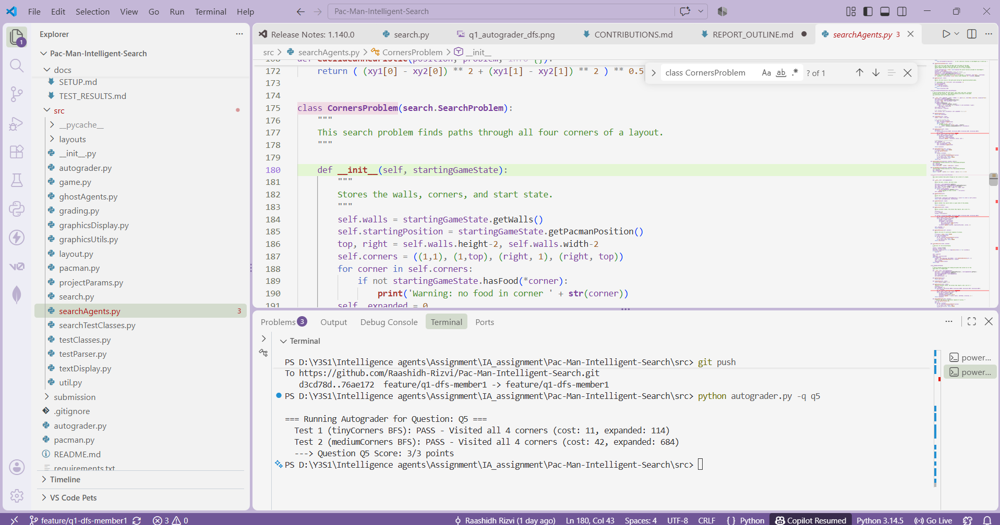

# Group Report Outline

## 1. Introduction & Problem Statement
- Overview of Pac-Man state-space search.

## 2. Uninformed Search Algorithms (Q1 - Q3)
### 2.1 Depth First Search (Q1) — S.P.R.H. Wijesiri (IT24100602)

**Logic & Implementation:**  
Depth First Search (DFS) explores the state space by following one path as deeply as possible before backtracking. We implemented DFS in the `depthFirstSearch(problem)` function in `search.py` using `util.Stack`, which follows the Last-In, First-Out (LIFO) principle.

The algorithm begins by obtaining the start state using `problem.getStartState()` and pushing it onto the stack together with an empty action list. During each iteration, a state and its associated action path are popped from the stack. The algorithm checks whether the current state is the goal using `problem.isGoalState(state)`. If it is the goal, the sequence of actions is returned.

A `visited` set is used to keep track of expanded states. This prevents cycles and ensures that the same state is not expanded more than once. For each unvisited successor returned by `problem.getSuccessors(state)`, the new action is added to the current action path and the successor is pushed onto the stack.

**Autograder Evidence:**

### 2.2 Breadth First Search (Q2) — Atheek Fareez (IT24103933)

**Logic & Implementation:**  
Breadth First Search (BFS) explores the state space level-by-level, ensuring that shallowest nodes are expanded first. We implemented BFS using `util.Queue`, which follows a First-In, First-Out (FIFO) queue policy. The algorithm begins by placing the start state on the queue. In each iteration, a node is dequeued and checked with `isGoalState()`. If it is not the goal and has not been expanded previously, it is added to a `visited` set to prevent cycles and redundant expansions. Successors are then pushed to the queue along with the accumulated action list. Because every action in this maze has a uniform step cost, BFS guarantees an optimal solution in terms of minimum number of actions.

**Autograder Evidence:**

### 2.3 Uniform Cost Search (Q3)
- Uniform Cost Search edge cost traversal.

## 3. Informed Search & Heuristics (Q4 - Q7)
- A* Search implementation.

### 3.2 Corners Problem (Q5) — S.P.R.H. Wijesiri (IT24100602)

**Logic & Implementation:**  
The Corners Problem requires Pac-Man to visit all four corners of the maze. The search state is represented using two parts: Pac-Man's current position and a tuple that records which of the four corners have already been visited.

The `getStartState()` method creates the initial state using Pac-Man's starting position and marks any corner that has already been visited. The `isGoalState()` method checks whether all four corners have been visited.

The `getSuccessors()` method considers the four possible movement directions: North, South, East, and West. A successor is only created when the movement does not hit a wall. If the new position is one of the four corners, the corresponding value in the visited-corners tuple is changed to `True`. Each legal movement has a step cost of 1.

The `getCostOfActions()` method verifies that the given sequence of actions does not pass through walls and returns the total number of actions as the path cost.

**Autograder Evidence:**

- Corners Heuristic design, proof of admissibility and consistency.
- Food Heuristic relaxation techniques (MST / Minimum Distance bounds).

## 4. Experimental Evaluation & Node Expansion Analysis
- Empirical comparison of expanded node counts.
- Graph visualizations and table breakdowns.

## 5. Team Management & Version Control
- Git contribution graphs.
- Parallel work breakdown.
