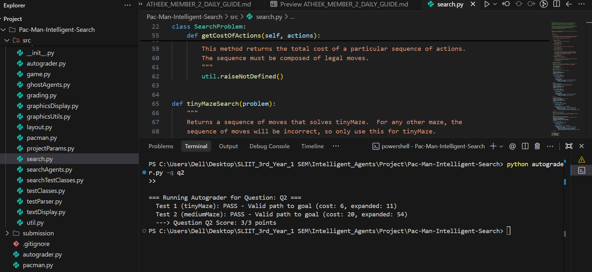

# Group Report Outline

## 1. Introduction & Problem Statement
- Overview of Pac-Man state-space search.

## 2. Uninformed Search Algorithms (Q1 - Q3)
- Depth First Search formulation and behavior.

### 2.2 Breadth First Search (Q2) — Atheek Fareez (IT24103933)
**Logic & Implementation:**
Breadth First Search (BFS) explores the state space level-by-level, ensuring that shallowest nodes are expanded first. We implemented BFS using `util.Queue`, which follows a First-In, First-Out (FIFO) queue policy. The algorithm begins by placing the start state on the queue. In each iteration, a node is dequeued and checked with `isGoalState()`. If it is not the goal and has not been expanded previously, it is added to a `visited` set to prevent cycles and redundant expansions. Successors are then pushed to the queue along with the accumulated action list. Because every action in this maze has a uniform step cost, BFS guarantees an optimal solution in terms of minimum number of actions.

- Uniform Cost Search edge cost traversal.

## 3. Informed Search & Heuristics (Q4 - Q7)
- A* Search implementation.
- Corners Problem state representation.
- Corners Heuristic design, proof of admissibility and consistency.
- Food Heuristic relaxation techniques (MST / Minimum Distance bounds).

## 4. Experimental Evaluation & Node Expansion Analysis
- Empirical comparison of expanded node counts.
- Graph visualizations and table breakdowns.

## 5. Team Management & Version Control
- Git contribution graphs.
- Parallel work breakdown.
